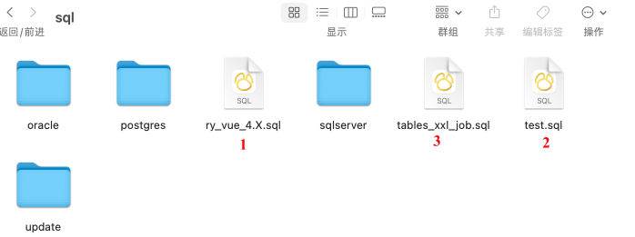
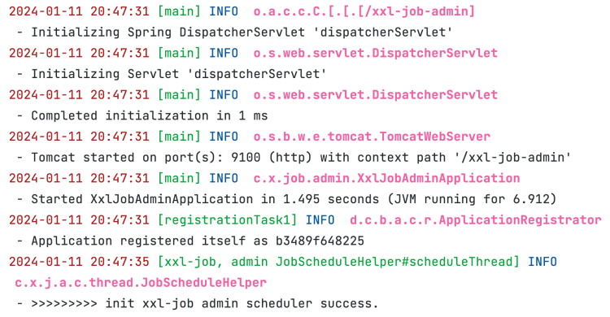
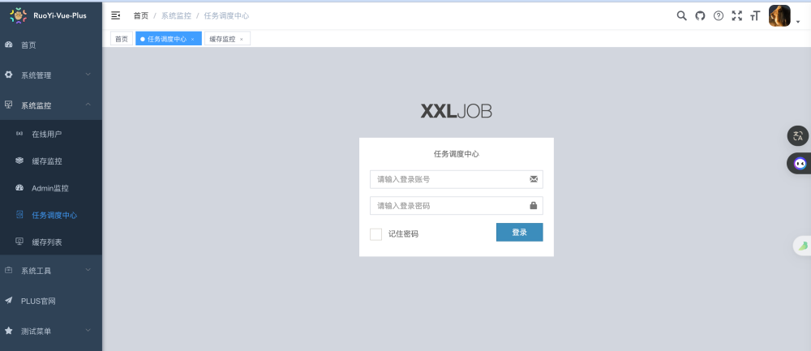

# 克隆项目并安装maven依赖

```shell
git clone https://github.com/dromara/RuoYi-Vue-Plus.git
cd RuoYi-Vue-Plus
mvn clean install package -Dmaven.test.skip=true
```

# 创建并导入数据库

数据库配置文件位置：`ruoyi-admin/pom.xml`

数据库文件位置：`script/sql`

按照如图所示顺序导入：



# 前端依赖安装

配置好`nodejs`后，进入`RuoYi-Vue-Plus/ruoyi-ui`进行前端依赖安装

```
cd RuoYi-Vue-Plus/ruoyi-ui
# 切换到 nonde 16 进行依赖安装
npm install --registry=https://registry.npmmirror.com
```

# 4. 后端启动

## 4.1. admin启动

运行`RuoYi-Vue-Plus/ruoyi-admin`下的启动类即可启动后端，启动后控制台输出如下信息：


## 4.2. 启动监控

### 4.2.1. 开启监控配置

```yaml
spring.boot.admin.client:
  # 增加客户端开关
  enabled: true
  url: http://localhost:9090/admin
  instance:
    service-host-type: IP
  username: ruoyi # 监控中心账号
  password: 123456 # 监控中心密码
```

运行`RuoYi-Vue-Plus/ruoyi-extend/ruoyi-monitor-admin`下的启动类，启动后输出一下信息


此时打开网页可以看到监控服务已经正常打开了，账号密码分别是：`ruoyi 123456`：


## 4.3. 启动定时任务

```yaml
--- # xxl-job 配置
xxl.job:
  # 执行器开关
  enabled: true
  # 调度中心地址：如调度中心集群部署存在多个地址则用逗号分隔。
  admin-addresses: http://localhost:9100/xxl-job-admin
  # 执行器通讯TOKEN：非空时启用
  access-token: xxl-job
  executor:
    # 执行器AppName：执行器心跳注册分组依据；为空则关闭自动注册
    appname: xxl-job-executor
    # 28080 端口 随着主应用端口飘逸 避免集群冲突
    port: 2${server.port}
    # 执行器注册：默认IP:PORT
    address:
    # 执行器IP：默认自动获取IP
    ip:
    # 执行器运行日志文件存储磁盘路径
    logpath: ./logs/xxl-job
    # 执行器日志文件保存天数：大于3生效
    logretentiondays: 30
```

如果设置的数据库密码不是`root`则需要进一步改动数据库配置文件

```yaml
# 数据库配置
spring:
  datasource:
    type: com.zaxxer.hikari.HikariDataSource
    driver-class-name: com.mysql.cj.jdbc.Driver
    url: jdbc:mysql://localhost:3306/ry-vue?useUnicode=true&characterEncoding=UTF-8&autoReconnect=true&serverTimezone=Asia/Shanghai
    username: root
    password: 123456
```

运行`ruoyi-extend/ruoyi-xxl-job-admin`下的启动类即可启动，启动后控制台输出如下信息：



然后打开网页可以看到任务中心可以正常看到，账号密码分别为 `admin 123456`：

