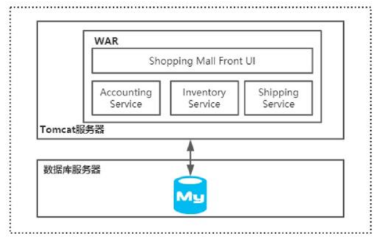
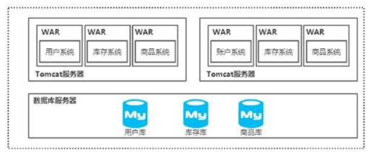
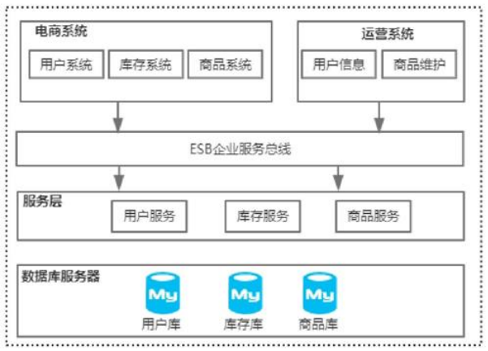
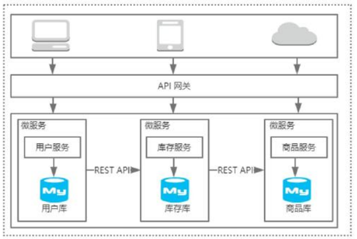
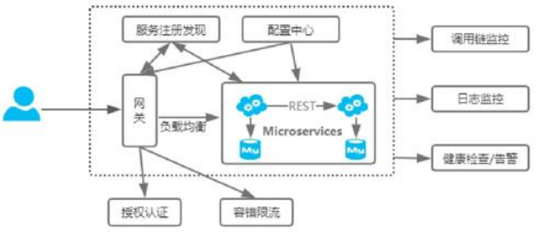

# 【Spring Cloud】微服务架构

## 目录
- [1. 目录](#目录)
- [2. 单体架构](#单体架构)
    - [集群及垂直化](#集群及垂直化)
- [3. 面向服务架构（Service-Oriented Architecture，SOA）](#面向服务架构service-oriented-architecturesoa)
    - [场景](#场景)
- [4. 微服务架构](#微服务架构)

## 单体架构

一个war包或者jar包内包含一个应用的所有功能

优点：架构足够简单，能够快速开发和上线

### 集群及垂直化

单体架构的缺点：

- 用户量越来越大，网站的访问量不断增大，导致后端服务器的负载越来越高。

- 用户量大了，产品需要满足不同用户的需求来留住用户，使得业务场景越来越多并且越来越复杂。

服务器的负载越来越高会导致用户在网站上操作的响应非常慢甚至无法访问；业务场景的复杂性也会导致war包或者jar包中的代码量持续上升，并且各个业务代码之间的耦合度也会越来越高，后期的代码维护和版本发布涉及的测试和上线，也会很困难。

优化方法：

- 通过横向增加服务器，把单台机器变成多台机器的集群。
- 按照业务的垂直领域进行拆分，减少业务的耦合度，以及降低单个war包带来的伸缩性困难问题。

## 面向服务架构（Service-Oriented Architecture，SOA）

### 场景

在商城系统中，用户执行下单操作的过程中需要先检查商品库存，库存足够才能提交订单。那么库存查询操作应该放在订单子系统还是库存子系统中。需要解决的问题是：存在许多共享业务场景是，这些被重复创建的逻辑产生的冗余代码是否能够抽离出来构成可重用的服务。

如下图所示，将共享服务提取出来作为系统和服务之间的通信桥梁。在SOA中，会采用ESB（企业服务总线）来作为系统和服务之间的通信桥梁，ESB本身还提供服务地址的管理、不同系统之间的协议转化和数据格式转化等。调用端不需要关心目标服务的位置，从而使得服务之间的交互是动态的，这样做的好处是实现了服务的调用者和服务的提供者之间的高度解耦。SOA主要解决一下问题：

- 信息孤岛
- 共享业务重用

## 微服务架构

微服务架构是为了让被拆分出来的服务能够以业务功能的维度进行拆分和独立部署，这样可以降低业务的耦合性以及提升容错性。

由于SOA和微服务两者的关注点不一样，造成了这两者有非常大的区别：、

- SOA关注的是服务的重用性及解决信息孤岛问题。
- 微服务关注的是解耦，虽然解耦和可重用性从特定的角度来看是一样的，但本质上是有区别的，解耦是降低业务之间的耦合度，而重用性关注的是服务的复用。
- 微服务会更多地关注在DevOps的持续交付上，因为服务粒度细化之后使得开发运维变得更加重要，因此微服务与容器化技术的结合更加紧密。

