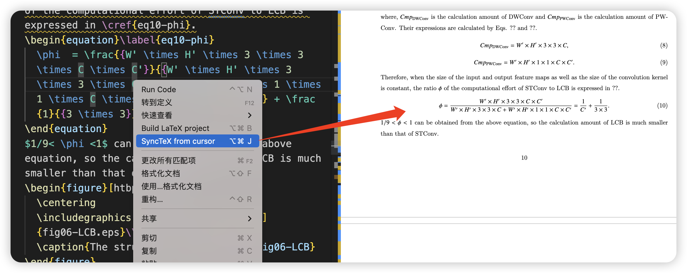
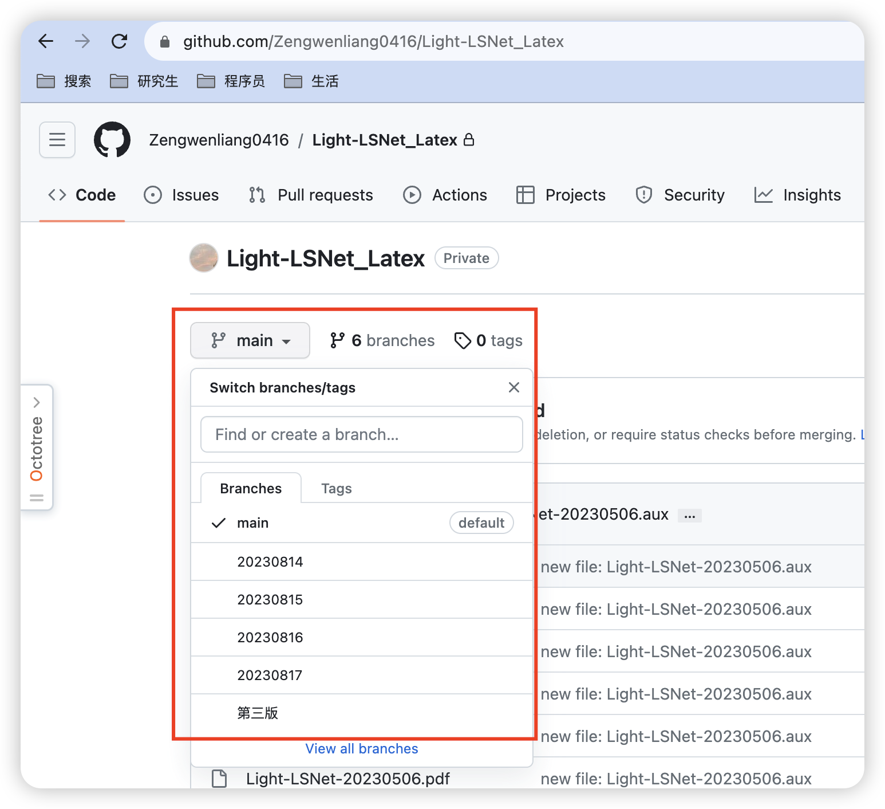

# 原因：

1. 插件丰富，支持拼写检查；


2. 检索快速，一键替换；


3. 设置简单，易于操作；

通过设置json能够实现多种操作。

4. 兼容性强；

编译文件在winEdit上同样能够编译通过，在发给张老师之前在winEdit编译通过一遍即可。

5. 定位快速；

pdf->latex:

可以设置双击某一行定位到代码处，也可以设置ctrl+单击

latex->pdf：

​	右键单击SyncTex from cursor后可以定位到pdf的具体位置




6. 结合Github进行版本控制，提高论文修改进度；

​	一定要设置为**private**，否则有论文泄漏的风险。每次更新论文的时候可以创建一个分支，这样就不会丢失上次的修改记录。当修改到最终版之后合并到主分支。



7. 软件全开源，无需破解付费，傻瓜式安装。

# Latex安装（本机有tex直接跳到VScode安装）

## 方式一

### 官网下载安装（安装流程比较慢，大概需要半天左右才能把所有包安装完成）

​	进入官网：[TeX Live - TeX Users Group (tug.org)](https://www.tug.org/texlive/)，找到如下下载位置。


点击下载位置：


自定义安装路径


## 方式二（我未验证过）

从国内镜像源安装，详细教程看这篇：[使用VSCode编写LaTeX - 知乎 (zhihu.com)](https://zhuanlan.zhihu.com/p/38178015)

# VScode安装

## 官网下载

进入官网（https://code.visualstudio.com/download）


一键式安装，一路next即可，详细安装可参照链接：[VSCode安装配置使用教程（最新版超详细保姆级含插件）一文就够了_vscode使用教程_神兽汤姆猫的博客-CSDN博客](https://blog.csdn.net/msdcp/article/details/127033151)

## 插件下载

使用latex必备的两个插件：LaTeX Workshop（编译运行工具）和Ltex（拼写检查工具）


## 修改用户设置

​	在vscode文件夹中按下F1，点击user settings进入json页面。


详细配置如下：

```json
{
    "workbench.colorTheme": "Default Dark Modern",
    "liveServer.settings.donotVerifyTags": true,
    "liveServer.settings.donotShowInfoMsg": true,
    "explorer.confirmDelete": false,
    "files.autoSave": "afterDelay",
    "explorer.confirmDragAndDrop": false,
    // 设置何时使用默认的(第一个)编译链自动构建 LaTeX 项目，即什么时候自动进行代码的编译。
    "latex-workshop.latex.autoBuild.run": "onSave",
    // 启用上下文LaTeX菜单
    "latex-workshop.showContextMenu": true,
    // 从使用的宏包中自动提取命令和环境，从而补全正在编写的代码
    "latex-workshop.intellisense.package.enabled": true,
    // 文档编译错误时是否弹出显示出错和警告的弹窗
    "latex-workshop.message.error.show": false,
    "latex-workshop.message.warning.show": false,
    // recipes 编译链中被使用的编译命令
    "latex-workshop.latex.tools": [
        {
            "name": "xelatex",
            "command": "xelatex",
            "args": [
                "-synctex=1",
                "-interaction=nonstopmode",
                "-file-line-error",
                "%DOCFILE%"
            ]
        },
        {
            "name": "pdflatex",
            "command": "pdflatex",
            "args": [
                "-synctex=1",
                "-interaction=nonstopmode",
                "-file-line-error",
                "%DOCFILE%"
            ]
        },
        {
            "name": "latexmk",
            "command": "latexmk",
            "args": [
                "-synctex=1",
                "-interaction=nonstopmode",
                "-file-line-error",
                "-pdf",
                "-outdir=%OUTDIR%",
                "%DOCFILE%"
            ]
        },
        {
            "name": "bibtex",
            "command": "bibtex",
            "args": [
                "%DOCFILE%"
            ]
        }
    ],
    // 对编译链进行定义，可以解决设计bib文件的编译问题
    "latex-workshop.latex.recipes": [
        {
            "name": "XeLaTeX",
            "tools": [
                "xelatex"
            ]
        },
        {
            "name": "PDFLaTeX",
            "tools": [
                "pdflatex"
            ]
        },
        {
            "name": "BibTeX",
            "tools": [
                "bibtex"
            ]
        },
        {
            "name": "LaTeXmk",
            "tools": [
                "latexmk"
            ]
        },
        {
            "name": "xelatex -> bibtex -> xelatex*2",
            "tools": [
                "xelatex",
                "bibtex",
                "xelatex",
                "xelatex"
            ]
        },
        {
            "name": "pdflatex -> bibtex -> pdflatex*2",
            "tools": [
                "pdflatex",
                "bibtex",
                "pdflatex",
                "pdflatex"
            ]
        },
    ],
    // 开启自动换行
    "editor.wordWrap": "on",
    //自动清除辅助文件
    "latex-workshop.view.pdf.viewer": "tab",
    "latex-workshop.latex.autoClean.run": "onBuilt",
    "latex-workshop.latex.clean.fileTypes": [
    "*.aux",
    "*.bbl",
    "*.blg",
    "*.idx",
    "*.ind",
    "*.lof",
    "*.lot",
    "*.out",
    "*.toc",
    "*.acn",
    "*.acr",
    "*.alg",
    "*.glg",
    "*.glo",
    "*.gls",
    "*.ist",
    "*.fls",
    "*.log",
    "*.fdb_latexmk"
    ],
    "json.schemas": [
    ],
    // 使用最近一次使用的编译链
    "latex-workshop.latex.recipe.default": "lastUsed",
    // 反向同步
    "latex-workshop.view.pdf.internal.synctex.keybinding": "double-click",
}
```

# Github安装使用

​	阅读官方文档即可，文档地址：[GitHub 入门文档 - GitHub 文档](https://docs.github.com/zh/get-started)。

## 常用命令：

​	掌握以下命令控制论文版本就够了，命令使用同样阅读官方文档。

```makefile
git add .
git commit -m "commit message"
git branch
git checkout [branch name]
git merge [branch name]
git push [remote branch name] [local branch name]
```

