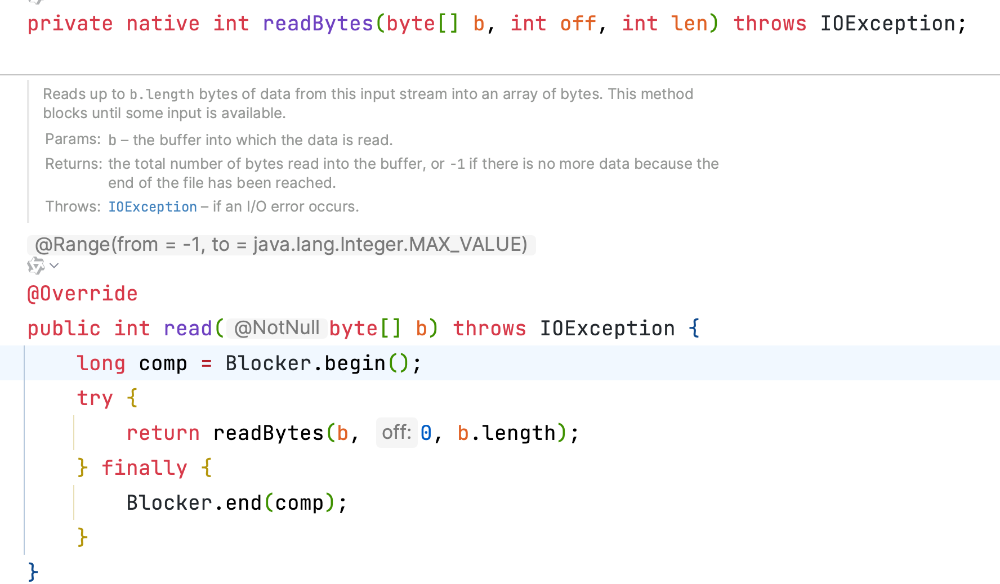

# 【设计模式】模板方法模式

**模板方法模式**是一种行为设计模式， 它在超类中定义了一个算法的框架， 允许子类在不修改结构的情况下重写算法的特定步骤。

模板方法模式是一种行为设计模式，他的主要作用就是复用代码。在很多时候，我们的代码中可能会有一些公共的部分并且还有一些定制的部分，那么公共这部分就可以定义在一个父类中，然后将定制的部分实现在子类中。这样子类可以根据需要扩展或重写父类的方法，而不需要改变算法的结构。

我们通常会把模板方法模式和策略模式一起使用，因为当我们使用策略模式的时候，会把具体的策略实现在策略服务里面，但是还剩下一些通用的逻辑，就可以通过模板方法模式进行复用。

# 扩展知识

## 示例

JAVA的核心库中就有不少才用了模版方法的类，比如：java.io.InputStream、 java.io.OutputStream、 java.io.Reader 和 java.io.Writer，java.util.AbstractList、 java.util.AbstractSet 和 java.util.AbstractMap。

以java.io.InputStream作为例子说明：

在Java中，`java.io.InputStream` 是一个抽象类，它是所有字节输入流的超类。这个类中定义了几个用于读取输入流的方法，其中一些是具体方法，而另一些则是抽象方法。在设计模式中，模板方法是一种方法，它在父类中定义了算法的骨架，允许子类在不改变算法结构的情况下重写算法的特定步骤。

在 `InputStream` 中，模板方法的例子是 `read()`。它有几个重载的版本，但核心的一个是这样定义的：


这个 `read()` 方法是一个抽象方法，它的作用是从输入流读取下一个数据字节。返回的是一个表示字节值的 `int`（0到255）。如果因为已经到达流末尾而没有字节可读，则返回 `-1`。

`InputStream` 还提供了其他几个 `read(byte[] b, int off, int len)` 和 `read(byte[] b)` 方法的具体实现，它们使用这个抽象的 `read()` 方法来从流中读取多个字节。这些方法的实现构成了模板方法模式，因为它们提供了算法的骨架（读取多个字节和/或直到EOF），而算法的一个关键步骤（读取单个字节）则留给了子类去实现。

例如，这里是 `read(byte[] b)` 方法的一个具体实现，该实现在内部使用了抽象的 `read()` 方法：


在这段代码中，`read(byte[] b, int off, int len)` 方法使用了抽象的 `read()` 方法来逐个字节地填充字节数组。它读取了至多 `len` 个字节，并将它们存储在 `b` 中，从索引 `off` 开始。如果在读取了至少一个字节后到达了流的末尾，则停止读取，并返回实际读取的字节数。这种方法依赖于具体的子类如 `FileInputStream`、`BufferedInputStream` 等来提供 `read()` 方法的实现细节。

FileInputStream：

从这里可以看到FileInputStream重写了InputStream的read方法并通过调用native方法获取当前buffer中的总字节数。



ByteArrayInputStream：

`ByteArrayInputStream`是Java I/O库中的一个类，它继承自`InputStream`。这个类将一个字节数组封装成一个`InputStream`，使得你可以从数组中读取数据，就好像从物理流（比如文件输入流）中读取一样。

这个类特别有用于以下情景：

1. 当你已经拥有数据，并且想要使用处理`InputStream`的代码来处理这些数据时。
2. 在测试代码时，你可以提供预定义的数据而不是读取实际的文件或网络资源。
3. 用于快速将字节数据转换为流，以便使用需要`InputStream`的API。

因为`ByteArrayInputStream`不涉及网络或磁盘I/O操作，所以它比从文件系统中读取数据或通过网络读取数据要快得多。


这段代码是`ByteArrayInputStream`中`read`方法的实现，它用于从输入流读取下一个字节的数据。这个方法返回的是一个`int`值，其中包含了读取的字节。如果成功读取一个字节，返回值应该在`0`到`255`的范围内，这是一个无符号字节能够有的所有可能的值。如果输入流的末尾已经到达，并且没有可读的字节，方法返回`-1`。


简单示例

```java
byte[] bytes = {1, 2, 3, 4, 5}; // 示例字节数组
InputStream inputStream = new ByteArrayInputStream(bytes);

int data = inputStream.read(); // 读取第一个字节，值为1
while(data != -1) {
    // 处理数据...
    data = inputStream.read(); // 继续读取下一个字节
}
inputStream.close(); // 关闭流
```

# 总结

以上就是模版方法的定义和应用，简单来说，通过模版方法我们就可以在不同子类中实现多种业务功能。这种方式和直接继承类的区别在于：继承抽象类的子类必须完全实现抽象方法（除非子类也是抽象类）。

